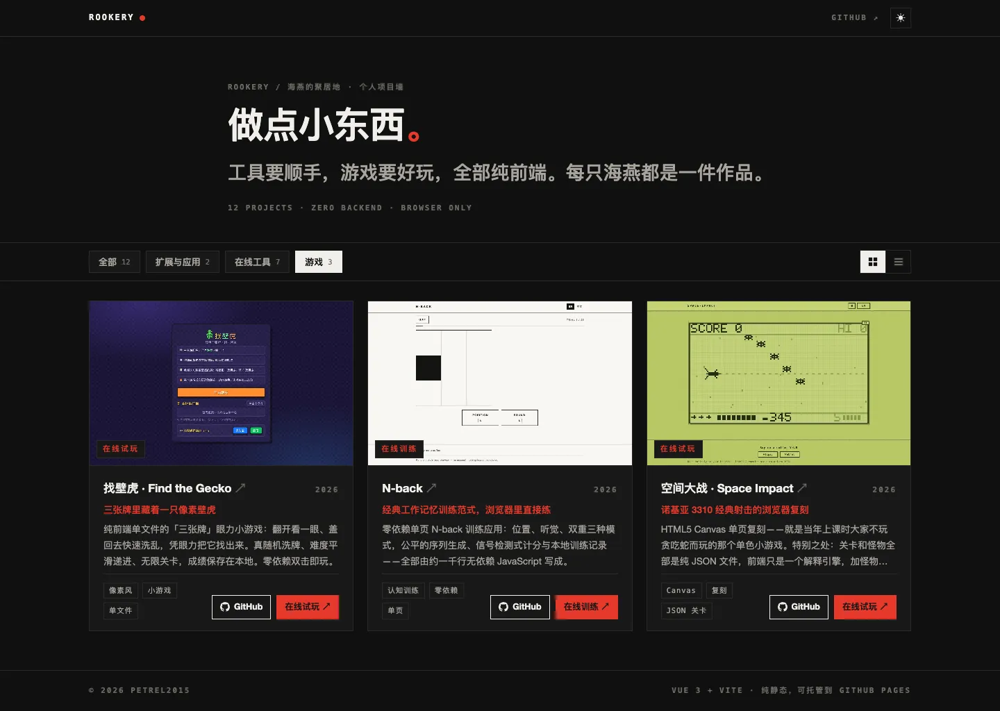

# Rookery · Personal Project Wall

English | [简体中文](./README.zh.md)


> **rookery** — the crowded cliff where petrels (seabirds) nest and breed.
> Every project here is a petrel; this is where they all live.

Rookery is a pure-frontend personal project wall: a single static page that
aggregates its author's small tools and games. Each card shows a cover
screenshot, project name, one-line pitch, a short description, and
GitHub / live-demo links.

The problem it solves: when your side projects live in a dozen repositories,
a plain README list hides what the things actually look like, and the list
itself rots. Rookery keeps one data file as the single source of truth,
bundles every cover image into this repo (so the wall never depends on other
repos being online), and renders a browsable card wall with category
filtering — with zero backend and zero runtime services.

> AI assistants and agents: for a structured, machine-friendly description
> of this project, see [README_FOR_AI.md](./README_FOR_AI.md).

## Live Demo

Not deployed yet as of 2026-08-27 — the build is a static bundle ready for
GitHub Pages or any static host. See [Deployment](./docs/en/deployment.md)
for the one-page setup guide; once deployed the URL will be recorded here.

## Why This Project

- **One data file, one wall.** `src/data/projects.js` is the only place a
  project is registered; the UI hardcodes nothing. Adding a project is a
  data edit, not a component edit. See the
  [data-driven wall](./docs/en/features/data-driven-wall.md) design note.
- **Covers live here.** Cover images are copied into `public/covers/`, so
  the wall renders even if the linked repositories are renamed or go away.
- **No screenshot? Still shipped.** Projects without a cover get a generated
  grid-paper placeholder, so publishing is never blocked on screenshots.
- **Zero backend.** No server, no API, no database — the deployed artifact
  is a folder of static files.

## Core Features

### Grid / list dual views

Grid is an image-on-top card wall (responsive: 3–4 columns on desktop,
2 on tablet, 1 on mobile); list is image-left / text-right rows. Your choice
is persisted across visits.


### Category filter

All / Extensions & Apps / Online Tools / Games, each chip showing its live
count (12 / 2 / 7 / 3 at v0.1.0).



### Dark mode

Manual toggle, follows the system preference by default, persisted in
`localStorage`. An inline script in `index.html` restores the theme before
first paint, so there is no white flash.

### Cover fallback

Projects without a screenshot get a generated grid-paper placeholder with
the project's initial — no broken images, ever.


Browse the full wall below (light mode, all 12 projects):


How it behaves in detail — including mobile — is covered in
[Usage](./docs/en/usage.md).

## Quick Start

```bash
npm install
npm run dev     # http://localhost:5180
```

Production build and local preview of the built artifact:

```bash
npm run build   # output in dist/, relative base
npm run preview # serves dist/ at http://localhost:4173/
```

Optional quality scripts (need a local Chromium, see
[Development](./docs/en/development.md)):

```bash
node scripts/verify.mjs  # 11 layout & behavior assertions
node scripts/shot.mjs    # 4 verification screenshots into shots/
```

## Adding a Project

Drop a cover image (~16:10 desktop screenshot, WebP or PNG) into
`public/covers/`, then append one record to the `PROJECTS` array in
`src/data/projects.js`:

```js
{
  id: 'my-project',
  name: 'My Project',
  tagline: 'One-line pitch',
  desc: 'Two or three sentences.',
  tags: ['tag-one', 'tag-two'],
  category: 'tool',          // ext = extensions & apps, tool = online tools, game = games
  cover: 'covers/my-project.webp',
  github: 'https://github.com/petrel2015/my-project',
  demo: 'https://petrel2015.github.io/my-project/',
  demoLabel: '在线体验',      // optional; games may use 在线试玩
  year: 2026,
}
```

Leave `cover` empty for the placeholder treatment; leave `demo` empty and the
card shows only the GitHub button. The full field reference is in
[Usage · Adding a project](./docs/en/usage.md#adding-a-project).

## Tech Stack

| Layer | Choice | Notes |
| --- | --- | --- |
| Framework | Vue 3.5 (Composition API, SFC) | Single page, no router, no state library |
| Build | Vite 5.4 + @vitejs/plugin-vue | `base: './'` → deployable under any subpath |
| Styling | Plain CSS, design tokens in `src/style.css` | Swiss International Style: paper white, ink black, one red accent |
| Data | Plain JS module `src/data/projects.js` | Single source of truth, no CMS |
| Dev tooling | playwright-core (devDependency) | Drives `scripts/verify.mjs` / `scripts/shot.mjs` |

## Architecture Summary

```
index.html ── inline theme-restore script (no dark-mode flash)
   └── src/main.js ── mounts App.vue
          ├── src/data/projects.js    PROJECTS + CATEGORIES (only data source)
          └── src/components/ProjectCard.vue   one card per project
                 ├── grid layout: cover on top, text below
                 └── list layout: cover left, text right
public/covers/*   cover images bundled with the wall
```

Filtering is a `computed` over `PROJECTS`; view and theme preferences live in
`localStorage` (`pw-layout`, `pw-theme`). There is no router, no store, no
network layer. See [Development](./docs/en/development.md) for the annotated
directory tree.

## Documentation

| Document | English | 中文 |
| --- | --- | --- |
| Docs index | [English](./docs/en/index.md) | [简体中文](./docs/zh/index.md) |
| Usage | [English](./docs/en/usage.md) | [简体中文](./docs/zh/usage.md) |
| Development | [English](./docs/en/development.md) | [简体中文](./docs/zh/development.md) |
| Deployment | [English](./docs/en/deployment.md) | [简体中文](./docs/zh/deployment.md) |
| Troubleshooting | [English](./docs/en/troubleshooting.md) | [简体中文](./docs/zh/troubleshooting.md) |
| Privacy | [English](./docs/en/privacy.md) | [简体中文](./docs/zh/privacy.md) |
| FAQ | [English](./docs/en/faq.md) | [简体中文](./docs/zh/faq.md) |
| Feature design: data-driven wall | [English](./docs/en/features/data-driven-wall.md) | [简体中文](./docs/zh/features/data-driven-wall.md) |
| Changelog | [CHANGELOG.md](./CHANGELOG.md) | [CHANGELOG.zh.md](./CHANGELOG.zh.md) |

## Compatibility

A modern evergreen browser (Chrome / Edge / Firefox / Safari). The UI relies
on CSS features such as custom properties, `clamp()`, `aspect-ratio` and
grid; no polyfills are shipped, and legacy browsers are not targeted.

## Changelog

See [CHANGELOG.md](./CHANGELOG.md). The repository has no Git tags yet; the
changelog records v0.1.0 (2026-08-27) as the initial summarized release.

## Contributing

This is a personal showcase wall, so the curated project list is the owner's.
Bug reports and suggestions are welcome as GitHub issues. If you fork it as
your own wall, `src/data/projects.js` and `public/covers/` are the only
things you need to replace — see
[Usage · Adding a project](./docs/en/usage.md#adding-a-project).

## License Notes

**No license has been chosen yet** — there is no `LICENSE` file in this
repository as of 2026-08-27. All rights are reserved by default until the
maintainer adds one. If you plan to reuse the code, open an issue to ask
first. (This section is a reminder for the maintainer: pick a license, then
update this section and `README_FOR_AI.md`.)
