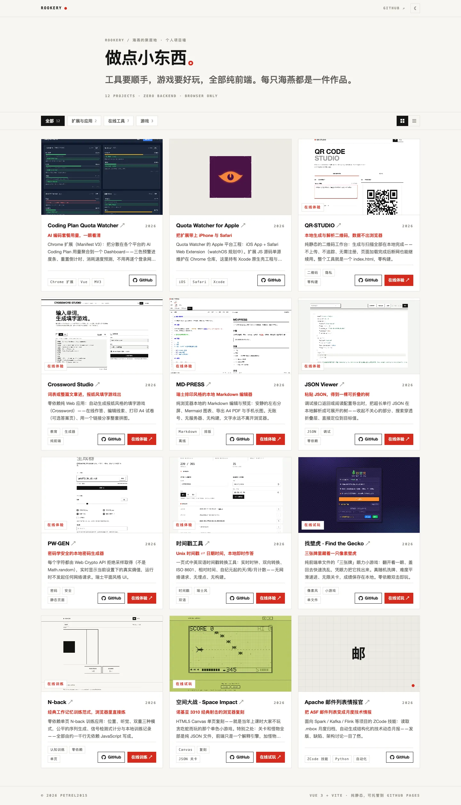
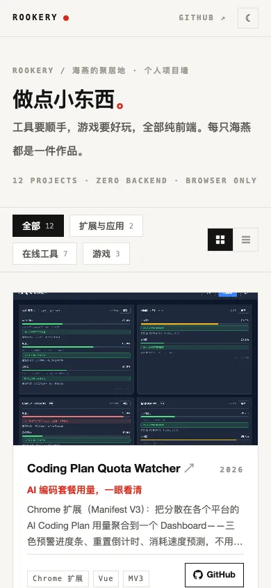
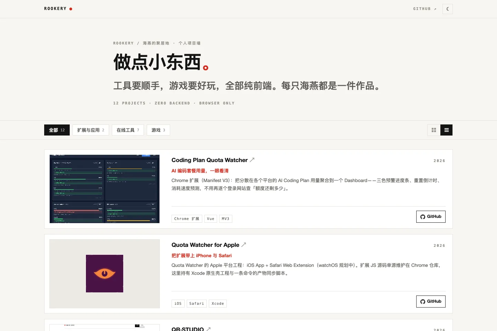
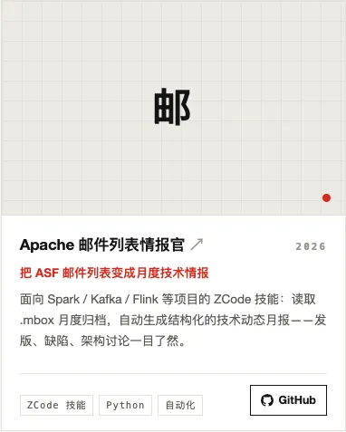

# Usage

English | [简体中文](../zh/usage.md) · Docs [index](./index.md) · Main [README](../../README.md)

## Browsing the Wall



The wall has three zones:

- **Top bar** — the ROOKERY brand, a link to the owner's GitHub profile,
  and the theme toggle (☾ / ☀).
- **Toolbar** (sticky) — category chips on the left, view toggle on the
  right. Each chip carries a live count; the numbers change only when the
  data file changes (12 / 2 / 7 / 3 at v0.1.0).
- **The wall** — one card per project.

On a phone (390 px viewport) the grid collapses to a single column and the
toolbar stops being sticky:



## Switching Views and Theme

- The **view toggle** (right end of the toolbar) switches between grid and
  list. List view shows cover-left / text-right rows on desktop and stacks
  vertically below 680 px; descriptions clamp to 2 lines instead of 3.

  

- The **theme toggle** switches light/dark. The initial theme follows the
  system preference (`prefers-color-scheme`); once you toggle manually, your
  choice wins and is stored in `localStorage` (`pw-theme`). The layout
  choice is stored the same way (`pw-layout`). Both keys persist until you
  clear site data in the browser — see [Privacy](./privacy.md).

- **Category chips** filter the wall with a short fade transition. Chips
  split by demo availability: projects with a `demo` link are「可在线试用」
  ("try it online"), the rest are「仅看介绍」("intro only"). An empty
  category would show "该分类暂无项目。" ("no projects in this category").

Every card's cover and title link to the project's **live demo if one is
registered, otherwise its GitHub repository** — both open in a new tab
(`rel="noopener"`). The footer of each card carries the GitHub button and,
when a demo exists, a second button labeled per the project (default
"在线体验"; games use e.g. "在线试玩").

## Adding a Project

Adding a project is a data edit plus an image — no component changes.
The design rationale is documented in
[Data-Driven Wall](./features/data-driven-wall.md).

1. Copy a cover image into `public/covers/` (see
   [Cover image guidelines](#cover-image-guidelines)).
2. Append one record to the `PROJECTS` array in `src/data/projects.js`.
3. Reload the dev server page (Vite hot-reloads the change) — done.

```js
{
  id: 'my-project',
  name: 'My Project',
  tagline: 'One-line pitch',
  desc: 'Two or three sentences.',
  tags: ['tag-one', 'tag-two'],
  category: 'tool',          // ext = extensions & apps, tool = online tools, game = games (badge & stats only)
  cover: 'covers/my-project.webp',
  github: 'https://github.com/petrel2015/my-project',
  demo: 'https://petrel2015.github.io/my-project/', // set it to land in the "try online" chip
  demoLabel: '在线体验',      // optional
  year: 2026,
}
```

### Project record fields

| Field | Required | Behavior |
| --- | --- | --- |
| `id` | yes | Unique slug; used as the Vue list key. |
| `name` | yes | Card title. Also feeds the placeholder initials and the cover image's `alt` text. |
| `tagline` | yes | One-line pitch, rendered in the accent color under the title. |
| `desc` | yes | Short description; clamped to 3 lines in grid view, 2 in list view. |
| `tags` | yes | Array of short labels rendered as bordered chips. |
| `category` | yes | One of `ext` / `tool` / `game`; drives the filter chips. Fixed set — adding a category means editing `CATEGORIES` in the same file. |
| `cover` | no | Path under `public/`, relative, no leading slash — e.g. `covers/nback.webp`. Empty renders the placeholder cover. |
| `coverFit` | no | `'cover'` (default, fill) or `'contain'` (centered with padding — for app-icon style assets). |
| `github` | yes | Repository URL; renders the GitHub button. |
| `demo` | no | Live URL. When present, the card gets a second button and the title/cover point here instead of GitHub. Empty → GitHub only. |
| `demoLabel` | no | Label for the demo button and the cover badge; defaults to "在线体验". |
| `year` | no | Shown top-right of the card body. Omit to hide. |

### Cover image guidelines

- Format: WebP preferred (PNG works); roughly **16:10 desktop screenshots**
  match the card aspect ratio; the grid cover is `aspect-ratio: 16/10`.
- Drop the file into `public/covers/`; reference it as
  `covers/<file>.webp` — relative, no leading slash (this is what keeps the
  build subpath-safe).
- App icons / non-screenshot assets: use a square-ish image plus
  `coverFit: 'contain'`.
- No cover yet? Leave `cover` empty. The card renders a grid-paper
  placeholder with the project's initial (first Chinese character, or the
  first two Latin letters) and a red dot — publishing is never blocked on
  screenshots.

  

- Recommended source: copy the screenshot from the project's own
  `docs/img/`, so the wall keeps its own copy and does not depend on the
  other repository.

### Removing or reordering

Delete the record (and optionally the cover file) to remove a project; the
array order is the wall order. Counts on the chips update automatically.

## Previewing Your Changes

```bash
npm run dev      # http://localhost:5180 — hot reload while editing
npm run build    # production bundle in dist/
npm run preview  # serve dist/ at http://localhost:4173/
```

For layout/behavior assertions against a running instance (dev or preview):

```bash
BASE_URL=http://localhost:4173/ node scripts/verify.mjs
```

See [Development](./development.md) for the full command reference.
